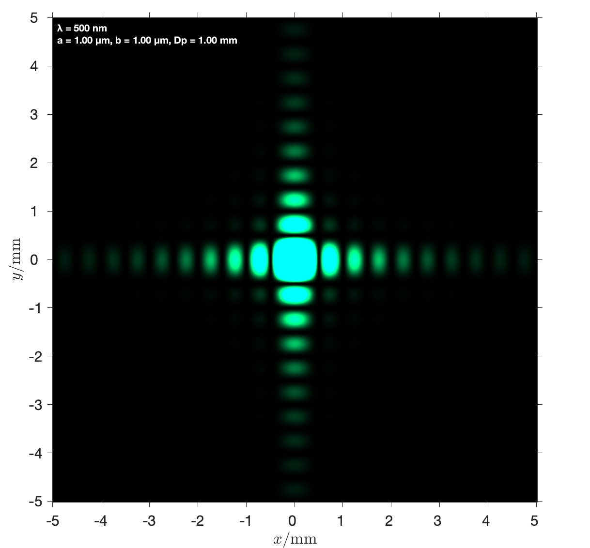
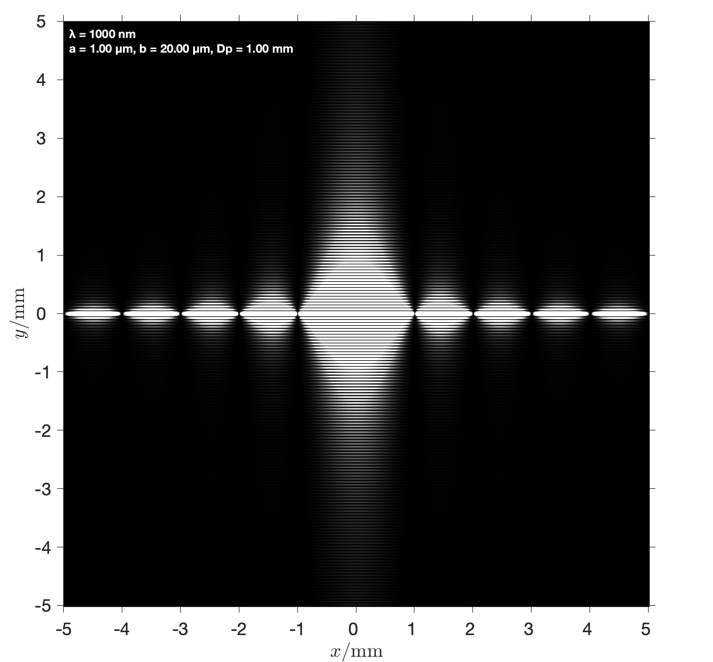
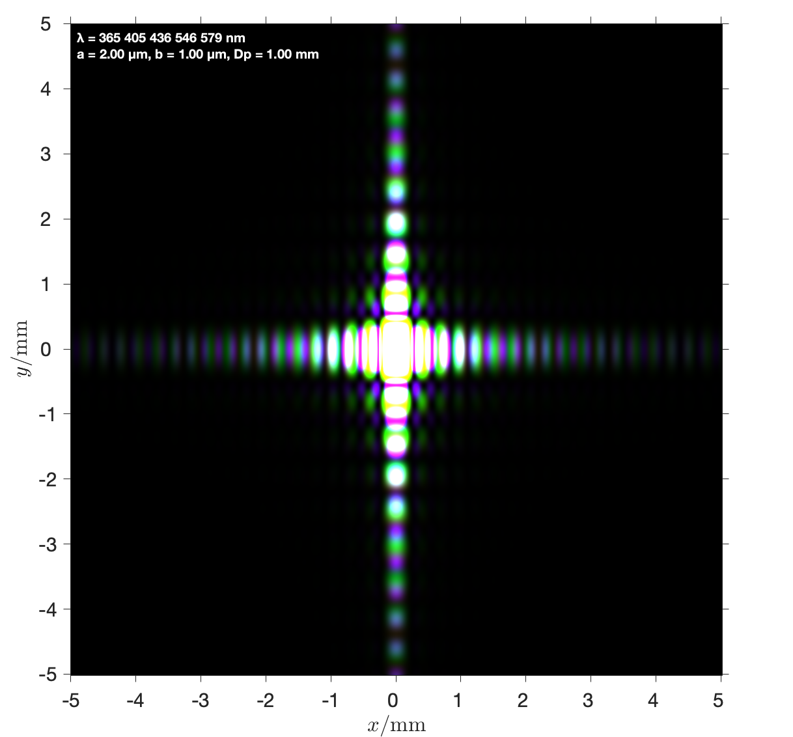
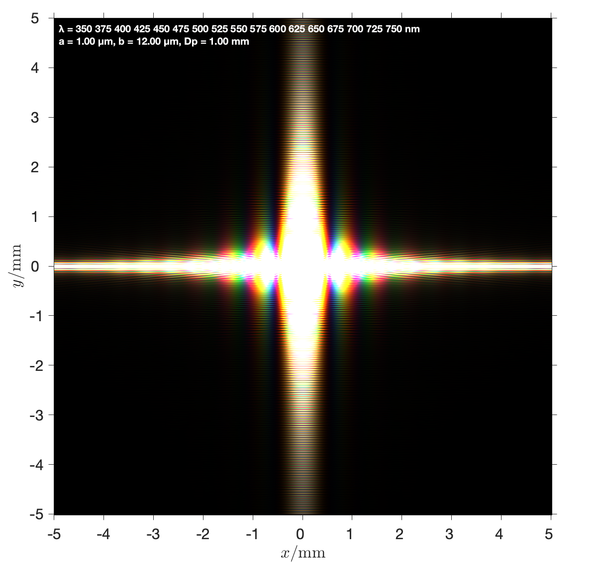

# RectangularDiffraction

**A MATLAB visualization of Fraunhofer diffraction of light by a rectangular aperture.**

***Features:*** Calculates the intensity distribution, colors the figure by wavelength, and handles multicolor situations. Light source, aperture size, light screen and image output parameters are all adjustable.



The code applies to a Fraunhofer diffraction with following ***assumptions***:

*   Only one aperture in rectangular size, thus considering **diffraction only**.

*   The distance between the light source and the aperture is much larger than the aperture size, so that the light on the aperture plane is considered as **parallel light incident perpendicularly and uniformly**.

*   The distance between the light screen and the aperture is much larger than the aperture size, so that the **Fraunhofer diffraction model** is applicable.

*   Each calculation only considers ideal monochromatic light with a **fix wavelength** in current version.

Thus the ***core equation*** to calculate intensity distribution is:


*This work is a part of course project of PH002, autumn, 2018.*


## Installation

1.  Download project folder

2.  Download the `spectrumRGB.m`, `RGB2HSI.m` and `HSI2RGB.m` functions to the same folder *(See the [Requirements](#Requirements) section for more information)*

3.  Run the [`test1.m`](test1.m) for the first illustration!


## Requirements

Tested on MATLAB R2018b. Image Processing Toolbox Required.

So far, this project (the `colorDiff.m` function, specifically) needs the following functions to perform the coloring feature properly:

*   `spectrumRGB.m` and its correlating functions: convert the spectral color with wavelength to RGB format, by Jeff Mather, The MathWorks, Inc., you can find it on [*MATLAB File Exchange*](https://www.mathworks.com/matlabcentral/fileexchange/7021-spectral-and-xyz-color-functions)

*   `RGB2HSI.m` and `HSI2RGB.m`: conversions between RGB and HSI format images, by R. C. Gonzalez, R. E. Woods, & S. L. Eddins,  Digital Image Processing Using MATLAB, you can find it on *a course page ([RGB2HSI.m](http://fourier.eng.hmc.edu/e161/dipum/rgb2hsi.m) and [HSI2RGB.m](http://fourier.eng.hmc.edu/e161/dipum/hsi2rgb.m))*


## Examples

#### Intensity image, infrared light, narrow aperture
```
λ =  1000 nm
a =  1.00 μm
b = 20.00 μm
```


#### Multiple colors of mercury lamp spectrum
```
λ = [365.05, 404.58, 435.87, 546.05, 579.11] nm
I = [  0.30,   0.40,   1.00,   0.80,   0.20] * 2.5e7
a = 2.00 μm
b = 1.00 μm
```


#### White light
```
λ = 350~750 nm
a =    1.00 μm
b =   12.00 μm
```



## Todos

*   Support different `lim` and `dim` input value for X and Y axis

*   Support the actual situation of non-ideal monochromatic light, that the wavelength is not a fix value but a range around center peak wavelength, in `intensityDiff()`

*   Support image controlling and displaying of brightness, contrast, etc.

*   Support color mapping for non-visible light

*   Support auto deciding value of `Iabs` for source, and `lim` for screen

*   Support other aperture shape of Fraunhofer diffraction, Fresnel diffraction and interference of light


## Acknowledgements

This project refers to or is inspired by the following works:

*   Jeff Mather, Spectral and XYZ Color Functions, on [MATLAB File Exchange](https://www.mathworks.com/matlabcentral/fileexchange/7021-spectral-and-xyz-color-functions).

*   R. C. Gonzalez, R. E. Woods and S. L. Eddins, [Digital Image Processing Using MATLAB](http://fourier.eng.hmc.edu/e161/)

*   Sathyanarayan Rao, Fraunhofer Diffraction of Light by a Rectangular Aperture, on [MATLAB File Exchange](https://www.mathworks.com/matlabcentral/fileexchange/47029-fraunhofer-diffraction-of-light-by-a-rectangular-aperture).

*   Ceng Haiying, Chen Dongdong, Zhang Ya, The Simulation of Diffraction Experiment of the Circular Hole Based on MATLAB, Journal of Yancheng Institute of Technology, 2011.

Also, sincere thanks to Professor Feng of PH002.


## License

See [`LICENSE`](LICENSE) for licensing information.
